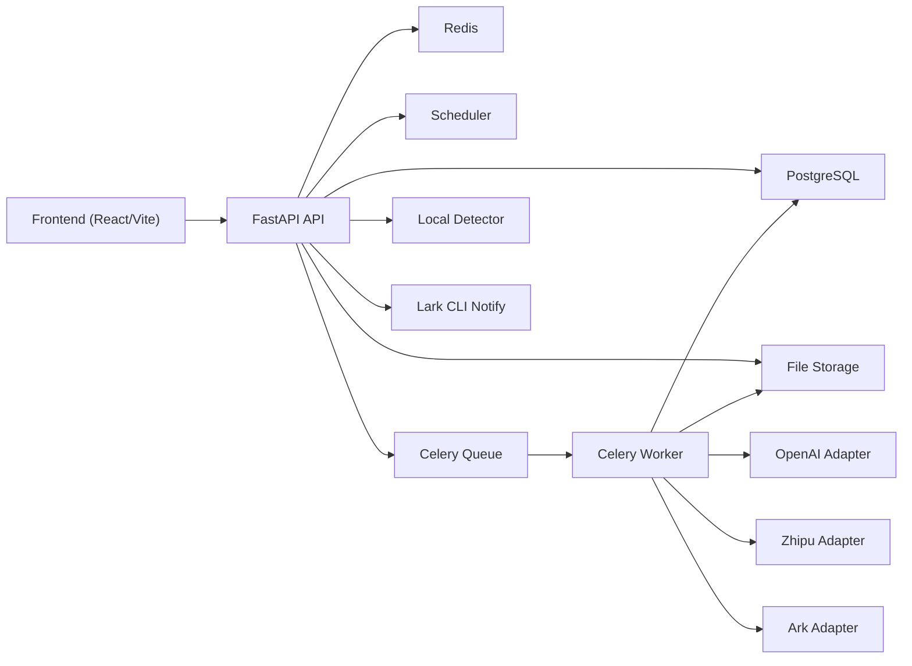

# 智能巡检系统 V2 终版综合分析报告

**文档版本**: v1.0
**文档状态**: 终版分析稿
**创建日期**: 2026-04-04
**分析范围**: 需求、方案、架构、代码实现与工程治理
**分析方式**: 基于现有文档、代码、脚本与测试的只读交叉审查

> 说明：本文档保留为 `2026-04-04` 时点的历史综合分析参考，不再直接代表当前代码事实。涉及当前代码结构、发布门禁、异步链路 readiness、`job_service` / `scheduler_service` 职责边界等结论时，请先阅读 `docs/architecture/智能巡检系统_V2_当前代码事实与治理边界说明.md`，再决定本轮治理优先级。

---

## 摘要

本报告对 `surveillance_aily` 当前 V2 主线进行了重新收敛分析，目标不是重复展示分散的审查视角，而是形成一份可直接用于管理决策和技术收敛的终版判断。总体结论是：产品方向正确，V2 目标架构也基本成立，但当前系统在需求基线一致性、验收追踪、架构边界、发布证据链和协作治理上存在明显缺口。如果继续在当前基础上优先扩功能，而不先做治理收敛，后续交付成本和回归风险会明显放大。

---

## 1. 需求与方案偏差报告

### 1.1 总体判断

需求层已经具备较完整的产品闭环定义，实施方案也完成了从阶段、模块到验收的基本拆分，但两者之间还没有形成严格闭环。当前最关键的问题不是“没有方案”，而是“基线不够一致、验收不可追踪、计划与交付证据未完全对齐”。这会导致团队在推进时对同一件事形成不同事实口径，从而引发范围漂移、验收争议和发布判断偏差。

### 1.2 偏差清单

| 编号 | 严重级别 | 偏差描述 | 影响 | 证据 |
| --- | --- | --- | --- | --- |
| RA-01 | P0 | 需求基线状态不一致。需求文档仍标记为“基线草案”，而 README 已表述“已补齐需求基线”。 | 需求是否已冻结无法形成统一判断，变更控制失效。 | `/Users/shaopeng/Downloads/surveillance_aily/docs/product/智能巡检系统_需求规格与功能更新方案_v2.md` ` /Users/shaopeng/Downloads/surveillance_aily/README_V2.md` |
| RA-02 | P0 | 技术约束口径不一致。需求层仍保留旧 `Flask` 基线语义，而实施设计和 README 已转向 `FastAPI + PostgreSQL + Redis + Celery`。 | 团队会按不同技术事实理解“当前系统”，造成方案评审与迁移边界分叉。 | `/Users/shaopeng/Downloads/surveillance_aily/docs/product/智能巡检系统_需求规格与功能更新方案_v2.md` `/Users/shaopeng/Downloads/surveillance_aily/docs/plan/智能巡检系统_V2_实施计划与功能设计方案.md` `/Users/shaopeng/Downloads/surveillance_aily/README_V2.md` |
| RA-03 | P1 | FR 与验收标准之间缺少正式追踪矩阵。 | 需求无法被系统性证明“已验证”，验收结论容易依赖人工解释。 | `/Users/shaopeng/Downloads/surveillance_aily/docs/product/智能巡检系统_需求规格与功能更新方案_v2.md` `/Users/shaopeng/Downloads/surveillance_aily/docs/testing/智能巡检系统_V2_全量验收清单.md` |
| RA-04 | P1 | 验收项与 Backlog/里程碑映射不闭合，尤其是媒体能力、任务重试、审计日志等重点能力。 | 方案层会出现“验收要求存在，但实施任务未被明确计划化”的断层。 | `/Users/shaopeng/Downloads/surveillance_aily/docs/testing/智能巡检系统_V2_全量验收清单.md` `/Users/shaopeng/Downloads/surveillance_aily/docs/plan/智能巡检系统_V2_Backlog与工程骨架方案.md` |
| RA-05 | P1 | Phase 5 范围过重，需同时完成联调、UAT、性能/安全、切换与回滚演练，但计划资源尤其是 QA 配置偏弱。 | 高概率造成阶段延期，或通过缩减验证范围来换取表面交付。 | `/Users/shaopeng/Downloads/surveillance_aily/docs/plan/智能巡检系统_V2_实施计划与功能设计方案.md` `/Users/shaopeng/Downloads/surveillance_aily/docs/architecture/智能巡检系统_V2_技术架构搭建与功能清单整改方案.md` |
| RA-06 | P2 | Backlog 完成定义允许“测试待补计划”关闭，与验收门槛要求的“P0/P1 闭环”不一致。 | 实施完成与可验收完成被混用，进度汇报失真。 | `/Users/shaopeng/Downloads/surveillance_aily/docs/plan/智能巡检系统_V2_Backlog与工程骨架方案.md` `/Users/shaopeng/Downloads/surveillance_aily/docs/testing/智能巡检系统_V2_全量验收清单.md` |

### 1.3 建议动作

1. 统一需求基线状态，在需求文档头部明确 `状态 / 生效日期 / owner / 冻结条件`，并同步 README 口径。
2. 补一份正式的 `FR -> Backlog -> 验收条目 -> 自动化测试` 追踪矩阵，作为评审和验收必备附件。
3. 对 Phase 5 进行重排，拆分为“联调与系统测试”和“切换与发布门禁”两段，避免验证任务被压缩到最后一周。
4. 为媒体能力、任务重试、审计日志补充明确的实施项、负责人和完成定义。
5. 收紧 Backlog 关闭标准，禁止以“待补测试计划”替代真实测试证据。

---

## 2. 系统架构与依赖结构报告

### 2.1 总体判断

从目标设计看，V2 架构方向是正确的：前后端分离、异步任务、记录与反馈沉淀、统计分析解耦，这些核心原则在文档和工程骨架中都已成立。问题不在总体方向，而在实现边界已经开始退化。随着功能扩展，若继续把调度、通知、执行、前端 API 聚合等能力堆入少数核心模块，系统会从“分层架构”演变为“分目录的隐性巨石”。

### 2.2 目标架构与实际实现

目标架构在实施设计中已经明确为前端、API、异步队列、Worker、数据库、文件存储、本地检测和模型适配器的协同体系。当前仓库也已经具备对应实现骨架，包括 `frontend-v2`、`backend-v2/app/api`、`backend-v2/app/services`、`backend-v2/app/workers`、独立 scheduler 进程以及 provider adapters。

### 2.3 关键依赖说明

- 强依赖：`FastAPI API`、`PostgreSQL`、`Redis`、`Celery Worker`、`Scheduler`。这些依赖任一失效，都会直接影响任务创建、执行或结果沉淀。证据：`/Users/shaopeng/Downloads/surveillance_aily/docs/plan/智能巡检系统_V2_实施计划与功能设计方案.md` `/Users/shaopeng/Downloads/surveillance_aily/backend-v2/app/core/celery_app.py`
- 条件强依赖：`Local Detector`。当严格门控打开时，本地检测不可用会阻断计划任务或信号监测，表现为“任务不产出”。证据：`/Users/shaopeng/Downloads/surveillance_aily/backend-v2/app/services/local_detector_service.py` `/Users/shaopeng/Downloads/surveillance_aily/backend-v2/app/services/scheduler_service.py`
- 可选依赖：`Lark CLI Notify`。主要影响告警路由发送，不影响核心任务执行。证据：`/Users/shaopeng/Downloads/surveillance_aily/README_V2.md`
- 容易造成 silent failure 或假成功的依赖：`Local Detector` 和 `Provider mock fallback`。前者会造成任务被门控跳过，后者会在真实模型不可用时返回 mock 结果，使链路表面可用但结果不可用于质量判断。证据：`/Users/shaopeng/Downloads/surveillance_aily/backend-v2/app/services/local_detector_service.py` `/Users/shaopeng/Downloads/surveillance_aily/backend-v2/app/services/providers/zhipu_adapter.py`

### 2.4 架构偏差清单

| 编号 | 严重级别 | 偏差描述 | 影响 | 证据 |
| --- | --- | --- | --- | --- |
| AR-01 | P0 | `alert_service` 同时承担领域规则、持久化、HTTP webhook 发送、Lark CLI 适配与错误翻译。 | 告警相关变更会牵动整块代码，测试、替换与扩展成本高。 | `/Users/shaopeng/Downloads/surveillance_aily/backend-v2/app/services/alert_service.py` |
| AR-02 | P0 | `scheduler_service` 负责定时触发、摄像头巡检、信号门控、预检和补投递，职责过载。 | 调度能力扩展会快速放大单模块复杂度，形成新的系统单点。 | `/Users/shaopeng/Downloads/surveillance_aily/backend-v2/app/services/scheduler_service.py` |
| AR-03 | P1 | 服务层直接依赖 worker 执行机制，出现 service 反向依赖执行层。 | 队列执行器难以替换，业务层与基础设施强耦合。 | `/Users/shaopeng/Downloads/surveillance_aily/backend-v2/app/services/job_service.py` `/Users/shaopeng/Downloads/surveillance_aily/backend-v2/app/services/scheduler_service.py` |
| AR-04 | P1 | 前端 `configCenter.ts` 承载多域 API，已形成跨域聚合层。 | 前端按域治理和并行开发会越来越困难，修改冲突增加。 | `/Users/shaopeng/Downloads/surveillance_aily/frontend-v2/src/shared/api/configCenter.ts` |
| AR-05 | P1 | 路由权限与菜单权限分散在不同位置维护。 | 权限规则容易漂移，出现“菜单可见但不可访问”或反向问题。 | `/Users/shaopeng/Downloads/surveillance_aily/frontend-v2/src/app/AppRouter.tsx` `/Users/shaopeng/Downloads/surveillance_aily/frontend-v2/src/layouts/AppLayout.tsx` |
| AR-06 | P1 | worker/scheduler readiness 未显式纳入预检，manual trigger 与 scheduler 定时扫描存在竞态。 | 异步链路表现出非确定性，难以稳定复现联调结果。 | `/Users/shaopeng/Downloads/surveillance_aily/scripts/v2/preflight.sh` `/Users/shaopeng/Downloads/surveillance_aily/README_V2.md` |

---

## 3. 代码实现与工程治理报告

### 3.1 工程成熟度结论

当前工程已经具备产品化平台的骨架能力，包括前后端结构、测试脚本、验收脚本、回填与发布门禁入口，但仍然停留在“可运行、可演示、可局部验证”的阶段，尚未进入“可严格交付、可稳定放行、可长期协作”的成熟状态。换句话说，系统已经有平台雏形，但工程治理能力还没有跟上产品复杂度。

### 3.2 测试

- 测试体系不闭环。接口层覆盖明显强于真实异步链路和前端 E2E，导致“后端接口全绿”不代表“真实任务链路全绿”。证据：`/Users/shaopeng/Downloads/surveillance_aily/backend-v2/tests` `/Users/shaopeng/Downloads/surveillance_aily/frontend-v2/e2e`
- `conftest.py` 使用 SQLite 且关闭 Celery，使测试环境与真实部署环境脱节。这个问题足以解释为什么异步/调度类问题更容易在联调阶段暴露。证据：`/Users/shaopeng/Downloads/surveillance_aily/backend-v2/tests/conftest.py`
- 媒体能力、导出口径一致性、登录态边界和真实 PostgreSQL/Redis/Celery 回归仍然是测试缺口最高的区域。证据：`/Users/shaopeng/Downloads/surveillance_aily/backend-v2/tests/test_jobs_and_records.py` `/Users/shaopeng/Downloads/surveillance_aily/frontend-v2/e2e/jobs-queue-flow.spec.ts`

### 3.3 发布验证

- 发布门禁可旁路。`release-gate.sh` 允许 `--skip-uat`、`--without-release-drill`、`--allow-without-release-drill`，说明默认门禁仍是软约束。证据：`/Users/shaopeng/Downloads/surveillance_aily/scripts/v2/release-gate.sh`
- 验证产物没有绑定 `git SHA / branch / build id / run id`，因此当前摘要更像“运行记录”，而不是“可审计证据”。证据：`/Users/shaopeng/Downloads/surveillance_aily/scripts/v2/verify.sh` `/Users/shaopeng/Downloads/surveillance_aily/scripts/v2/uat.sh` `/Users/shaopeng/Downloads/surveillance_aily/scripts/v2/preflight.sh`
- `preflight` 仅对 API 健康做显式确认，没有验证 worker 和 scheduler 的 readiness，异步链路存在非确定性。证据：`/Users/shaopeng/Downloads/surveillance_aily/scripts/v2/preflight.sh`

### 3.4 提审与评审闭环

- 提审材料不完整。仓库里缺少“一页式变更摘要、影响面、测试证据、风险与回滚”的正式评审包。证据：`/Users/shaopeng/Downloads/surveillance_aily/docs/testing/摄像头中心_抽帧触发规则配置说明与测试报告.md` `/Users/shaopeng/Downloads/surveillance_aily/docs/testing/智能巡检系统_V2_全量验收清单.md`
- 缺陷闭环机制不完整。虽然已有优先级和评审节奏，但缺少统一的状态流转、复验责任、关闭标准和证据要求。证据：`/Users/shaopeng/Downloads/surveillance_aily/docs/architecture/智能巡检系统_V2_技术架构搭建与功能清单整改方案.md` `/Users/shaopeng/Downloads/surveillance_aily/docs/testing/智能巡检系统_V2_全量验收清单.md`
- 闭环模板中的分级口径与总体缺陷优先级口径并未完全一致，容易在验收阶段造成解释冲突。证据：`/Users/shaopeng/Downloads/surveillance_aily/docs/architecture/智能巡检系统_V2_技术架构搭建与功能清单整改方案.md` `/Users/shaopeng/Downloads/surveillance_aily/docs/testing/智能巡检系统_V2_全量验收清单.md`

### 3.5 协作隔离

- 并行开发治理偏弱，没有明确的 worktree/分支隔离规范。证据：`/Users/shaopeng/Downloads/surveillance_aily/docs`
- `data/` 目录产物与“latest file”逻辑会污染验证结论，尤其在多人并行执行验证脚本时更明显。证据：`/Users/shaopeng/Downloads/surveillance_aily/scripts/v2/release-checklist.sh` `/Users/shaopeng/Downloads/surveillance_aily/scripts/v2/release-gate.sh`
- 脚本链路未校验工作区是否干净，也没有实例隔离策略，容易出现“验证结果与实际提交不一致”的问题。证据：`/Users/shaopeng/Downloads/surveillance_aily/scripts/v2/verify.sh` `/Users/shaopeng/Downloads/surveillance_aily/scripts/v2/deps-up.sh` `/Users/shaopeng/Downloads/surveillance_aily/scripts/v2/deps-down.sh`

---

## 4. 综合评价与优先级优化建议

### 4.1 是否存在需求偏差

存在。偏差主要集中在三类问题：

- 基线定义不一致
- 验收不可追踪
- 版本边界和实施范围存在模糊区

这类问题不会立刻让系统“跑不起来”，但会持续消耗排期、验收和发布判断的可信度。

### 4.2 是否存在设计/架构问题

存在，但不是方向错误，而是边界退化与治理不足。当前架构仍然站在正确方向上，只是关键模块已经出现职责堆叠、基础设施耦合和并行链路非确定性。如果继续扩展而不先收敛，后续每新增一个能力，回归面和协作成本都会同步放大。

### 4.3 统一判断

- 产品方向：正确
- 需求治理：中低成熟
- 架构设计：中等成熟，边界退化明显
- 工程交付：具备骨架，但证据链与门禁不足
- 当前阶段建议：暂停继续扩功能，先做一次治理收敛

### 4.4 优先级优化建议

#### P0

- 统一需求、方案、README 的基线口径。
- 建立正式的追踪矩阵：`FR -> Backlog -> 验收条目 -> 自动化测试`。
- 收紧 `release gate`，禁止默认旁路，并把验证产物绑定到代码版本与运行参数。

#### P1

- 补真实异步回归：PostgreSQL + Redis + Celery + Scheduler。
- 把安全验证、切换对账和回填验证纳入正式门禁。
- 增加正式提审材料模板：变更摘要、影响面、测试证据、风险与回滚。

#### P2

- 拆分 `alert_service`、`scheduler_service`。
- 引入任务派发接口，去除 service 对 worker 的反向依赖。
- 按域拆分前端 API 聚合层，降低 `configCenter.ts` 的跨域耦合。

#### P3

- 明确 worktree/分支/验证实例隔离策略。
- 为 `data/` 产物建立运行 ID、归档与清理规范。
- 统一缺陷生命周期、复验机制与关闭标准。

---

## 结语

这套系统已经跨过“原型”和“脚手架”的阶段，进入了真正需要治理能力支撑的阶段。当前最合理的动作不是继续叠加功能，而是用一轮短周期治理，把基线、验证、门禁、边界和协作收紧到可控状态。完成这一步之后，后续扩展才不会在错误的结构上继续加速。
