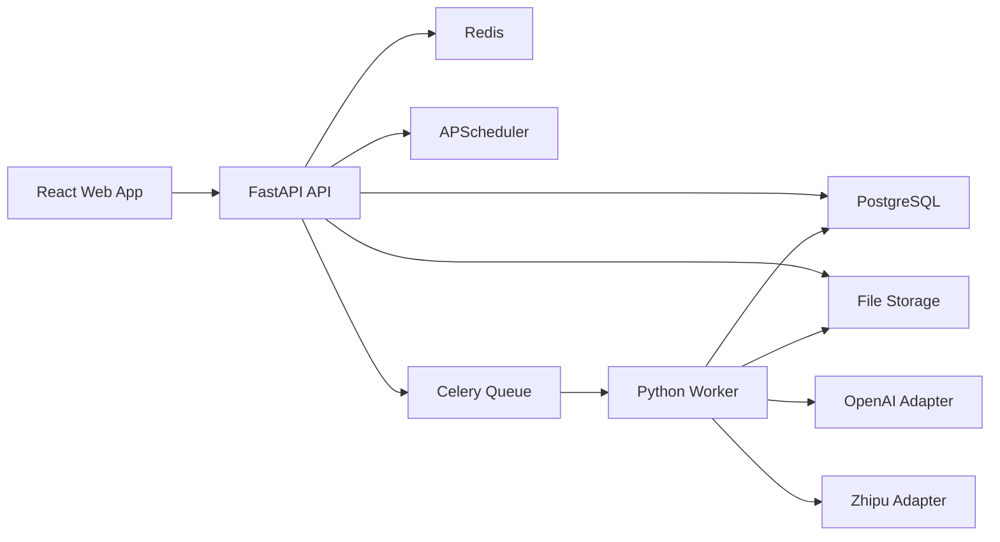

# 智能巡检系统 V2 - 实施计划与功能设计方案

**文档版本**: v1.1
**文档状态**: P0 实施基线冻结
**创建日期**: 2026-03-22
**生效日期**: 2026-04-04
**文档 Owner**: 技术负责人（ARCH）
**关联需求**: [智能巡检系统_需求规格与功能更新方案_v2.md](../product/智能巡检系统_需求规格与功能更新方案_v2.md)
**执行分工**: [智能巡检系统_V2_技术架构搭建与功能清单整改方案.md](../architecture/智能巡检系统_V2_技术架构搭建与功能清单整改方案.md)
**执行 Backlog**: [智能巡检系统_V2_Backlog与工程骨架方案.md](./智能巡检系统_V2_Backlog与工程骨架方案.md)
**追踪矩阵**: [智能巡检系统_V2_需求到验证追踪矩阵.md](./智能巡检系统_V2_需求到验证追踪矩阵.md)

---

## 1. 文档目标

本文档用于将 V2 需求基线转化为可执行的实施方案，明确：

- 项目实施阶段、时间节点、任务和交付物
- 功能模块拆分、接口定义和数据流转
- 技术栈、架构设计与关键技术方案
- 用户交互流程和页面原型
- 测试策略与验收方式
- 风险识别与应对机制

本文档默认以 **全栈重构 + 8-10 周交付** 为计划基线，适用于独立版智能巡检平台主线。

### 1.1 基线治理信息

- **生效基线**：2026-04-04 起执行。
- **冻结条件**：
  - Phase 0 输出（领域模型、接口命名、页面树、迁移映射）全部签字确认。
  - P0 Backlog 无阻断项，且对应验收项已映射自动化入口。
  - `docs/plan/智能巡检系统_V2_需求到验证追踪矩阵.md` 更新完成并通过评审。
- **统一口径**：后端技术栈唯一口径为 FastAPI + PostgreSQL + Redis + Celery。

---

## 2. 项目实施总览

### 2.1 目标

V2 的目标是在既有系统经验基础上建设统一的新平台，后端主线口径固定为 FastAPI，不再并行维护 Flask 交付口径：

- 前端：React + TypeScript + Vite + Ant Design
- 后端：FastAPI + PostgreSQL + Redis + Celery
- 模型执行：保留 Python 主链，统一模型适配层
- 交付边界：以“策略、摄像头、任务、记录、反馈、看板”为核心

### 2.2 总体交付策略

- 老系统在 V2 切换前保持“只修不扩”
- 新系统以并行入口方式建设
- 先交付 V1 核心闭环，再逐步补齐 V2 增强项
- 数据迁移以“历史回填 + 切换前增量同步”方式执行

### 2.3 里程碑日历

| 阶段 | 时间 | 目标 |
|---|---|---|
| Phase 0 | 2026-03-23 ~ 2026-03-27 | 冻结方案与接口契约 |
| Phase 1 | 2026-03-30 ~ 2026-04-10 | 搭建前后端骨架与基础设施 |
| Phase 2 | 2026-04-13 ~ 2026-04-24 | 完成配置中心 |
| Phase 3 | 2026-04-27 ~ 2026-05-08 | 完成任务中心 |
| Phase 4 | 2026-05-11 ~ 2026-05-22 | 完成记录、反馈、看板与迁移 |
| Phase 5 | 2026-05-25 ~ 2026-05-29 | 联调、验收与切换 |

---

## 3. 分阶段实施计划

### Phase 0 - 方案冻结

**时间**

- 2026-03-23 至 2026-03-27

**主要任务**

- 冻结领域模型：`Strategy / Camera / Job / TaskRecord / Feedback / Dashboard`
- 冻结接口命名与 URL 规范
- 冻结前端信息架构与页面清单
- 冻结数据迁移范围与旧表映射关系
- 冻结模型评估样本集口径与指标定义
- 形成 V1 与 V2 增强项边界表

**交付物**

- 架构说明文档
- API 契约草案
- 数据模型草案
- 低保真页面原型
- 里程碑与资源计划

**验收门槛**

- 不再讨论核心对象命名
- 不再讨论 V1 功能范围边界
- 新系统的正式入口路径、数据库方案和任务模型已固定

### Phase 1 - 基础平台

**时间**

- 2026-03-30 至 2026-04-10

**主要任务**

- 初始化 React 前端工程
- 初始化 FastAPI 后端工程
- 建立 PostgreSQL schema v1 和 Alembic 迁移体系
- 接入 Redis 和 Celery 基础队列
- 建立 JWT + RBAC 基础认证能力
- 建立统一配置模块、日志模块、错误处理中间件
- 建立文件存储抽象层
- 建立模型提供方适配接口和占位实现

**交付物**

- FastAPI skeleton
- React skeleton
- PostgreSQL schema v1
- Alembic
- JWT/RBAC 基线
- 文件存储服务
- CI 基线

**验收门槛**

- 前后端都可本地运行
- 登录后可进入空壳后台
- API 文档可浏览
- 数据库迁移命令可执行

### Phase 2 - 配置中心

**时间**

- 2026-04-13 至 2026-04-24

**主要任务**

- 完成模型提供方配置模块
- 完成分析策略模块
- 完成 JSON Schema 校验服务
- 完成摄像头配置模块
- 完成摄像头状态检查服务
- 完成相关前端页面与表单

**交付物**

- `/api/model-providers`
- `/api/strategies`
- `/api/cameras`
- `/api/cameras/{id}/status`
- 对应 UI 页面

**验收门槛**

- 策略、模型提供方、摄像头三类对象可完整 CRUD
- 摄像头状态可轮询、可手动触发检查
- Schema 校验可对策略返回格式做静态校验

### Phase 3 - 任务中心

**时间**

- 2026-04-27 至 2026-05-08

**主要任务**

- 完成单张/批量上传任务
- 完成摄像头单次任务
- 完成定时任务与计划对象
- 完成任务状态机与取消机制
- 完成 worker 执行链路
- 完成错误回传、重试策略和任务日志
- 完成任务中心页面

**交付物**

- `/api/jobs`
- `/api/job-schedules`
- Celery worker
- APScheduler schedule trigger
- 任务中心 UI

**验收门槛**

- 上传和摄像头两种任务都可进入队列并生成记录
- 任务状态完整流转
- 取消任务对未完成任务生效

### Phase 4 - 记录与分析

**时间**

- 2026-05-11 至 2026-05-22

**主要任务**

- 完成任务记录列表和详情页
- 完成 CSV 导出
- 完成人工反馈模块
- 完成基础看板和异常案例页
- 完成旧 SQLite 数据回填工具
- 建立反馈驱动的统计指标计算逻辑

**交付物**

- `/api/task-records`
- `/api/feedback`
- `/api/dashboard/*`
- 记录页、反馈页、看板页
- SQLite -> PostgreSQL 回填工具

**验收门槛**

- 记录、反馈、看板三条链路打通
- 历史数据至少能全量回填一次
- 看板与记录统计口径一致

### Phase 5 - 联调与切换

**时间**

- 2026-05-25 至 2026-05-29

**主要任务**

- 端到端联调
- 模型对比评估
- 性能测试、安全测试
- UAT
- 切换演练与上线清单准备
- 旧系统冻结与最终增量同步

**交付物**

- UAT 报告
- 模型评估报告
- 发布清单
- 回滚方案
- 切换说明

**验收门槛**

- 四条主流程全绿
- 基本性能、安全基线达标
- 有清晰回滚方案

---

## 4. 模块设计与功能拆分

## 4.1 认证与权限模块

### 核心功能

- 本地账号登录
- JWT access/refresh token
- 基础角色模型
- 菜单级和接口级权限控制
- 用户启用/禁用

### 核心接口

| 接口 | 方法 | 用途 |
|---|---|---|
| `/api/auth/login` | POST | 用户登录 |
| `/api/auth/refresh` | POST | 刷新令牌 |
| `/api/me` | GET | 获取当前用户 |
| `/api/users` | GET | 用户列表 |
| `/api/users` | POST | 创建用户 |
| `/api/users/{id}/status` | PATCH | 启用/禁用用户 |

### 数据流

登录页输入账号密码 -> FastAPI 验证 -> 返回 token -> 前端保存 token -> 路由守卫加载权限 -> 页面按角色显示菜单与按钮。

---

## 4.2 模型提供方与分析策略模块

### 核心功能

- 管理 OpenAI、智谱配置
- 管理分析策略
- 维护提示词模板和 JSON Schema
- 校验策略返回格式定义
- 维护预设策略模板

### 核心接口

| 接口 | 方法 | 用途 |
|---|---|---|
| `/api/model-providers` | GET | 获取提供方配置 |
| `/api/model-providers/{provider}` | PUT | 更新提供方配置 |
| `/api/strategies` | GET | 策略列表 |
| `/api/strategies` | POST | 创建策略 |
| `/api/strategies/{id}` | GET | 策略详情 |
| `/api/strategies/{id}` | PATCH | 更新策略 |
| `/api/strategies/{id}/status` | PATCH | 启用/禁用 |
| `/api/strategies/{id}/validate-schema` | POST | 校验 Schema |

### 关键实体

`ModelProviderConfig`

- provider
- display_name
- base_url
- api_key_masked
- default_model
- timeout_seconds
- retry_policy
- status

`AnalysisStrategy`

- name
- scene_description
- prompt_template
- model_provider
- model_name
- response_schema
- status
- is_preset
- version

### 数据流

管理员配置模型 -> 后端加密保存 -> 策略配置员选择模型和 Schema -> 保存策略版本 -> 任务创建时复制策略快照到执行记录。

---

## 4.3 摄像头配置与状态模块

### 核心功能

- 多摄像头管理
- 连接参数配置
- 抽帧参数配置
- 摄像头状态检查
- 异常告警提示

### 核心接口

| 接口 | 方法 | 用途 |
|---|---|---|
| `/api/cameras` | GET | 获取摄像头列表 |
| `/api/cameras` | POST | 创建摄像头 |
| `/api/cameras/{id}` | GET | 摄像头详情 |
| `/api/cameras/{id}` | PATCH | 更新摄像头 |
| `/api/cameras/{id}` | DELETE | 删除摄像头 |
| `/api/cameras/{id}/status` | GET | 获取状态 |
| `/api/cameras/{id}/check` | POST | 手动检查状态 |

### 关键实体

`Camera`

- name
- location
- ip_address
- port
- protocol
- username
- password
- rtsp_url
- frame_frequency_seconds
- resolution
- jpeg_quality
- storage_path

`CameraStatus`

- camera_id
- connection_status
- alert_status
- last_error
- last_checked_at

### 数据流

管理员录入摄像头 -> 状态巡检服务定期检测 -> 检测结果写入状态日志 -> 前端轮询状态接口 -> 页面显示在线/告警/离线。

---

## 4.4 任务中心模块

### 核心功能

- 上传任务：单张、批量
- 摄像头任务：单次、定时
- 队列执行
- 状态跟踪
- 取消任务
- 执行日志

### 核心接口

| 接口 | 方法 | 用途 |
|---|---|---|
| `/api/jobs/uploads` | POST | 创建上传任务 |
| `/api/jobs/cameras/once` | POST | 创建摄像头单次任务 |
| `/api/jobs` | GET | 获取任务列表 |
| `/api/jobs/{id}` | GET | 获取任务详情 |
| `/api/jobs/{id}/cancel` | POST | 取消任务 |
| `/api/job-schedules` | GET | 获取定时任务列表 |
| `/api/job-schedules` | POST | 创建定时任务 |
| `/api/job-schedules/{id}` | PATCH | 更新定时任务 |
| `/api/job-schedules/{id}/status` | PATCH | 启用/停用计划 |

### 关键实体

`Job`

- job_type
- trigger_mode
- strategy_id
- camera_id
- model_provider
- model_name
- status
- total_items
- completed_items
- failed_items
- error_message
- queued_at
- started_at
- finished_at

`JobSchedule`

- camera_id
- strategy_id
- cron_or_interval
- status
- next_run_at

### 数据流

前端发起任务 -> FastAPI 创建 `jobs` -> 写入 Redis 队列 -> Celery worker 执行 -> 调用模型 -> 生成 `task_records` -> 汇总更新 `jobs` 状态。

定时任务流：

计划保存到 `job_schedules` -> APScheduler 读取并触发 -> 生成实际 `jobs` -> 进入同一执行链路。

---

## 4.5 任务记录与反馈模块

### 核心功能

- 保存任务结果
- 查看详情
- 过滤查询
- CSV 导出
- 人工反馈标记

### 核心接口

| 接口 | 方法 | 用途 |
|---|---|---|
| `/api/task-records` | GET | 获取记录列表 |
| `/api/task-records/{id}` | GET | 获取记录详情 |
| `/api/task-records/export` | GET | 导出 CSV |
| `/api/feedback` | POST | 新增反馈 |
| `/api/feedback/{id}` | PATCH | 更新反馈 |

### 关键实体

`TaskRecord`

- job_id
- strategy_snapshot
- input_image_path
- preview_image_path
- source_type
- camera_id
- model_provider
- model_name
- raw_model_response
- normalized_json
- result_status
- duration_ms
- feedback_status

`PredictionFeedback`

- record_id
- judgement
- corrected_label
- comment
- reviewer
- reviewed_at

### 数据流

worker 完成任务 -> 写入任务记录 -> 列表页查询 -> 详情页展示原图/JSON/原始响应 -> 复核员提交反馈 -> 统计服务刷新聚合指标。

---

## 4.6 报告分析模块

### 核心功能

- 基础看板
- 趋势统计
- 异常案例列表
- 反馈驱动准确率

### 核心接口

| 接口 | 方法 | 用途 |
|---|---|---|
| `/api/dashboard/summary` | GET | 汇总指标 |
| `/api/dashboard/trends` | GET | 趋势数据 |
| `/api/dashboard/strategies` | GET | 策略统计 |
| `/api/dashboard/anomalies` | GET | 异常案例 |

### 数据流

看板页请求聚合接口 -> 后端从 `jobs + task_records + prediction_feedback` 聚合 -> 返回 KPI 和图表数据 -> 用户点击异常案例进入记录详情。

---

## 5. 核心数据流设计

### 5.1 上传任务数据流

1. 用户选择策略并上传图片
2. 前端调用 `/api/jobs/uploads`
3. API 写入 `jobs`
4. 文件进入本地文件存储
5. 任务 ID 写入 Redis 队列
6. worker 读取任务并执行模型调用
7. Schema 校验结果写入 `task_records`
8. 更新 `jobs` 聚合状态

### 5.2 摄像头单次任务数据流

1. 用户选择摄像头与策略
2. 调用 `/api/jobs/cameras/once`
3. worker 抽帧
4. 模型分析并校验 JSON
5. 生成记录
6. 结果返回列表与详情页

### 5.3 定时任务数据流

1. 用户创建 `job_schedule`
2. APScheduler 定时触发
3. 触发时生成一条实际 `job`
4. worker 按即时任务链路执行
5. 记录、反馈、看板共享同一数据源

### 5.4 反馈与统计数据流

1. 复核员在记录详情标记正确/错误
2. 写入 `prediction_feedback`
3. 聚合服务基于已复核记录计算准确率
4. 看板显示准确率和未复核比例

---

## 6. 技术实现方案

## 6.1 技术栈

| 层 | 技术 |
|---|---|
| 前端 | React 19 + TypeScript + Vite |
| UI | Ant Design |
| 状态管理 | TanStack Query + Zustand |
| 路由 | React Router |
| 图表 | ECharts 或 Recharts |
| 后端 | FastAPI + Pydantic v2 |
| ORM | SQLAlchemy 2.x |
| 迁移 | Alembic |
| 数据库 | PostgreSQL |
| 队列 | Redis + Celery |
| 调度 | APScheduler |
| 存储 | 本地文件系统抽象，预留 MinIO/S3 |
| 测试 | pytest + httpx + Vitest + React Testing Library + Playwright |

## 6.2 目录建议

### 前端目录

```text
frontend-v2/
├── src/
│   ├── app/
│   ├── layout/
│   ├── modules/
│   │   ├── auth/
│   │   ├── strategies/
│   │   ├── cameras/
│   │   ├── jobs/
│   │   ├── records/
│   │   ├── feedback/
│   │   └── dashboard/
│   ├── shared/
│   └── api/
```

### 后端目录

```text
backend-v2/
├── app/
│   ├── api/
│   ├── core/
│   ├── models/
│   ├── schemas/
│   ├── services/
│   ├── workers/
│   ├── adapters/
│   └── repositories/
├── alembic/
└── tests/
```

## 6.3 架构说明



### 架构原则

- API 层只负责认证、校验、调度、查询和任务投递
- worker 只负责执行任务和写结果
- schedule 只负责触发 job，不直接执行推理
- 统计接口只读取记录和反馈，不直接依赖任务瞬时状态

---

## 7. 关键技术难点与解决方案

| 难点 | 风险 | 方案 |
|---|---|---|
| 大模型返回不稳定 | JSON 不可解析 | 统一 provider adapter，Schema 校验失败时记录原始响应并允许一次修复重试 |
| RTSP 抽帧不稳定 | 空帧、断流、模糊 | 连接预检、3 次重试、状态日志、参数可调 |
| 任务取消复杂 | 队列任务难以中断 | 状态机 + Celery revoke + worker 协作式取消检查 |
| 定时与即时任务统一 | 模型混乱 | `job_schedules` 与 `jobs` 分离，`jobs` 只代表一次执行 |
| 指标口径失真 | 准确率不可信 | 准确率只基于已复核数据 |
| 密钥与文件安全 | 泄露与越权 | 密钥加密存储、接口脱敏、文件鉴权代理下载 |
| 旧系统切换 | 数据分叉 | 全量回填 + 增量同步 + 切换演练 |

---

## 8. 用户交互流程与页面原型

## 8.1 信息架构

- 登录
- 总览看板
- 任务中心
- 策略中心
- 摄像头中心
- 任务记录
- 人工复核
- 模型与系统设置
- 用户与权限

## 8.2 页面原型

### 1. 总览看板

```text
┌──────────────────────────────────────────────┐
│ 时间范围  策略筛选  模型筛选                 │
├──────────────────────────────────────────────┤
│ KPI: 任务总数 | 成功率 | 异常比例 | 结构化率 │
├──────────────────────────────────────────────┤
│ 趋势图            │ 策略使用频率柱状图       │
├──────────────────────────────────────────────┤
│ 异常案例列表 -> 点击进入记录详情             │
└──────────────────────────────────────────────┘
```

### 2. 任务中心

```text
┌──────────────┬─────────────────────┬──────────────┐
│ 创建任务面板 │ 任务队列表          │ 任务详情抽屉 │
│ - 上传       │ ID/状态/策略/进度   │ 输入源       │
│ - 摄像头     │ 创建时间/耗时/操作  │ 执行日志     │
│ - 定时       │                     │ 失败原因     │
└──────────────┴─────────────────────┴──────────────┘
```

### 3. 策略中心

```text
┌──────────────┬────────────────────────────────────┐
│ 策略列表     │ 策略编辑器                         │
│ 状态筛选     │ 基础信息 / 提示词 / 模型 / Schema  │
│ 搜索         │ 预设模板插入 / 校验结果预览        │
└──────────────┴────────────────────────────────────┘
```

### 4. 摄像头中心

```text
┌──────────────┬────────────────────────────────────┐
│ 摄像头卡片   │ 配置表单                           │
│ 状态灯       │ 名称/位置/IP/协议/认证            │
│ 协议/位置    │ 抽帧频率/分辨率/质量/路径         │
├──────────────┴────────────────────────────────────┤
│ 状态日志列表：最近检查时间 / 最近错误 / 告警状态 │
└───────────────────────────────────────────────────┘
```

### 5. 任务记录

```text
┌──────────────────────────────────────────────┐
│ 时间/策略/状态/摄像头/模型 筛选              │
├──────────────────────────────────────────────┤
│ 记录表格                                     │
├──────────────────────────────────────────────┤
│ 详情抽屉：原图 / JSON / 原始响应 / 反馈结果   │
└──────────────────────────────────────────────┘
```

### 6. 人工复核

```text
┌──────────────┬─────────────────────┬──────────────┐
│ 待复核队列   │ 图片 + 模型结论     │ 标记面板     │
│              │                     │ 正确/错误    │
│              │                     │ 修正标签/备注│
└──────────────┴─────────────────────┴──────────────┘
```

## 8.3 交互要求

- 上传区支持拖拽和点击选择
- 所有长耗时操作都要有状态提示
- 任务状态和摄像头状态优先使用颜色和图标区分
- 记录详情采用抽屉或侧边栏，避免频繁页面跳转
- 复核入口应可从记录详情直接进入

---

## 9. 测试策略

## 9.1 单元测试

### 后端

- provider adapter
- schema validator
- job 状态机
- schedule trigger
- camera status checker
- dashboard 聚合器
- auth/RBAC policy

### 前端

- 登录表单
- 任务创建表单
- 策略编辑器
- 摄像头状态卡片
- 记录详情 JSON viewer
- 反馈表单

## 9.2 集成测试

- FastAPI + PostgreSQL + Redis + Celery 联调
- 文件上传与本地存储
- RTSP mock stream 或测试视频流抓帧
- OpenAI/智谱 provider contract test
- SQLite -> PostgreSQL 迁移回归测试

## 9.3 系统测试

- 登录与权限矩阵
- 单张上传
- 批量上传
- 摄像头单次任务
- 定时任务
- 任务取消
- 结构化失败
- 记录查询和 CSV 导出
- 人工反馈到看板刷新

## 9.4 自动化工具

- 后端：`pytest + httpx + pytest-asyncio`
- 前端：`Vitest + React Testing Library`
- E2E：`Playwright`
- 性能测试：队列吞吐、状态轮询、长时运行稳定性

## 9.5 验收阈值

- 核心后端模块单测覆盖率目标 `>= 80%`
- 核心前端组件覆盖率目标 `>= 70%`
- 四条主流程 E2E 全绿
- 至少 24 小时定时任务稳定性测试通过

---

## 10. 风险管理方案

| 风险 | 概率/影响 | 应对措施 |
|---|---|---|
| 全栈重构范围膨胀 | 高/高 | 严格冻结 V1 边界，复杂增强项后置 |
| 摄像头现场兼容性差 | 高/高 | 建立设备白名单，先做状态检查再开放定时任务 |
| 模型输出结构不稳定 | 高/高 | adapter + schema validator + 原始响应留存 |
| 任务取消与调度复杂 | 中/高 | 先设计状态机，再编码实现 |
| 数据迁移不完整 | 中/高 | 全量回填 + 最终增量同步 + 对账脚本 |
| 文件与密钥安全不足 | 中/高 | 文件代理下载、密钥脱敏、审计日志 |
| 前端重构延期 | 中/中 | 先实现后台型 UI，不追求高复杂视觉 |
| 反馈样本不足 | 中/中 | 准确率口径只展示已复核数据，补充未复核比例 |
| 成本超预算 | 中/中 | 通过样本评估报告对比 OpenAI/智谱成本与效果 |

---

## 11. 资源与协作建议

### 建议团队配置

- 1 名技术负责人
- 1 名前端工程师
- 2 名后端/AI 工程师
- 0.5 名 QA 或测试支持

### 协作节奏

- 每周一：里程碑同步和风险检查
- 每周三：接口和前后端联调同步
- 每周五：阶段 demo 与问题清单更新

### 输出物管理

- 所有接口契约集中维护
- 数据库变更必须通过 Alembic
- 样本评估集与评估结果单独版本化

---

## 12. 实施边界与默认假设

- 启动时间按 2026-03-23 计算
- V1 不包含 ONVIF、拖拽式看板、异常复核工作台高级版、飞书/Aily 主流程恢复
- V1 使用 React + FastAPI 新架构建设并验收
- 旧 Flask 系统仅作为历史运行环境参考，不再作为实施与验收口径
- 生产环境数据库以 PostgreSQL 为准
- OpenAI 具体候选模型在 Phase 0 启动周按官方文档再次核验
